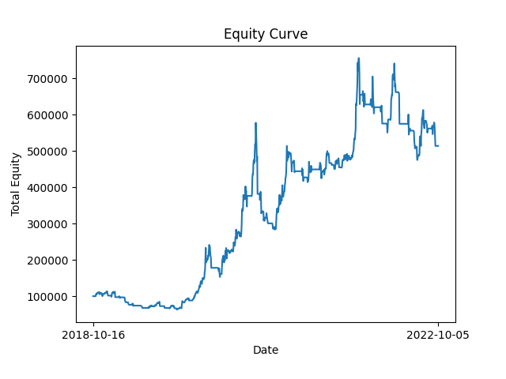
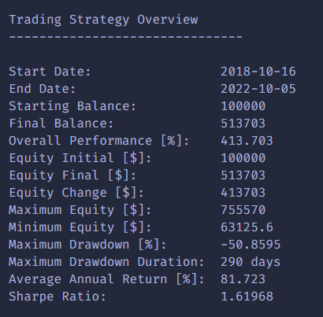

This program is an event-driven backtesting environment meant to simulate the trading environment for the development of algorithmic trading strategies. The program is implemented in C++ and offers portfolio tracking and custom strategy implementation.
This implementation is based off of the approach offered in Michael Halls-Moore's book *Successful Algorithmic Trading*. 

## Getting Started
#### Defining a Strategy
The user's algorthmic trading strategy can be defined by implementing a child of the strategy class found in **strategy.h**, or the sample trading strategy can be used.
#### Choosing Securities
The securities used for the backtester are located in the **./historical_data** folder as csv files, and any additional securities wanted by the user can be added to that folder for automatic inclusion. Additionally, the user can implement an instance of the **DataHandler** 
class found in **datahandler.h**, and doing so will allow the user to use different forms of data, whether that be alternative historical data (ex. MySQL database) or live trading data. 
#### Backtesting a Strategy
Calling `make` in the terminal will generate the necessary **backtester.exe** program, which can be run to demonstrate the strategy.

## Usage
#### Example Source Code
The user can choose one of the sample trading strategies included within the repository found in **strategy.h**, then define a start date for the strategy to begin. Using default values, create a Backtest 
object with the symbol(s) required by the strategy, and the starting date. For this example, we use the MovingAverageCrossover strategy with a short period of 5 days and a long period of 10 days on TSLA stock. We also
choose to begin on the date 2018-10-16. After creating the Backtest object, call the simulate_trading method.

```cpp
MovingAverageCrossover* strategy = new MovingAverageCrossover(5, 10, "TSLA");
Datetime* start_date = new Datetime("2010-12-16");
Backtest backtest = Backtest("TSLA", start_date, strategy);
backtest.simulate_trading();
```
#### Adjusting Backtest Parameters
Suppose we want to adjust the parameters of our Backtester to have an initial portfolio balance of 100,000, a simulation time between periods of 100 milliseconds, a maximum of 1000 trading periods,
and a 0.2% commission.
```cpp
Backtest backtest = Backtest("TSLA", start_date, strategy, 100000, 100, 1000, 0.002);
backtest.simulate_trading();
```
#### Reading Performance Output
Calling the simulate_trading function produces text output in the terminal as well as in the file **output/performance_metrics.txt**. The daily equity values can also be found in csv form in **output/equity_curve.csv**. Finall, the equity curve is plotted and saved to **output/plot.png**. These settings can be adjusted in the file **src/backtest.cpp** within the output_performance function. 

###### Sample Equity Curve


###### Sample Performance Metrics

